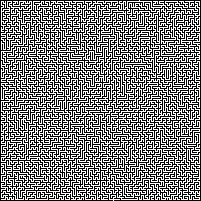

# MazeAlgos
This is a side project i am working on in my spare time, implementing a variety of algorithms to solve mazes. 


## Running the maze solving program
This is an example of the programs output after running:
```
python3 maze_solver.py /mazes/Daedelus/100x100.png a*
Maze Loaded Successfully!
Maze adjacency list built!
Path found in your maze! 
Image Saved in current directory as: /src/completed_maze.png
Runtime: --- 18.56 seconds ---
```




## Notes
To run any of the algorithms which have been implemented change the second argument of the python program to (a*,bfs).

This project still needs to be improved and refactored to be efficient. 

For now the main efficiency improvement that is of not is using an adjacency list instead of an adjacency matrix so it can handle larger mazes. 
